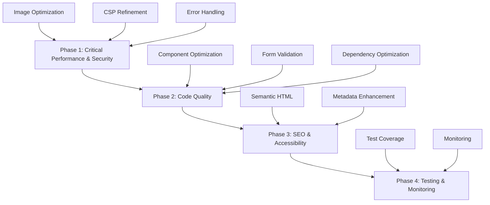

# Project Optimization Plan

## Project Overview
This is a Next.js 15 application with TypeScript, deployed on Cloudflare using OpenNext.js. The site is a landing page for a technology solutions company with contact form functionality, email notifications, and integrations with Slack and Telegram.

## Key Technologies
- Next.js 15 with App Router
- TypeScript
- Tailwind CSS with custom animations
- Cloudflare Workers deployment
- Turbopack for development
- Zod for validation
- Nodemailer for email
- Jest for testing
- React Icons
- React Turnstile for CAPTCHA

## Identified Optimization Opportunities

### 1. Performance Optimizations

#### Image Optimization
- Current implementation uses Next.js Image component correctly but could benefit from:
  - Proper sizing attributes
  - Priority loading for above-the-fold images
  - Lazy loading for below-the-fold images

#### Code Splitting
- Components are well-organized but could benefit from dynamic imports for non-critical components
- Consider dynamic imports for notification libraries (Slack/Telegram) to reduce bundle size

#### Bundle Size Reduction
- Remove unused dependencies
- Optimize CSS by removing unused styles
- Consider tree-shaking for icons (currently importing all react-icons)

### 2. SEO and Accessibility Improvements

#### Semantic HTML
- Improve semantic structure of pages
- Add proper ARIA attributes where missing
- Enhance form accessibility

#### Metadata Enhancement
- Expand OpenGraph tags
- Add structured data (JSON-LD)
- Improve sitemap with more pages/sections

### 3. Code Quality Improvements

#### Component Optimization
- Implement React.memo for components that render frequently
- Use useCallback for event handlers
- Optimize re-renders in ContactForm component

#### Error Handling
- Improve error boundaries
- Add more comprehensive error logging
- Better user feedback for different error states

#### Form Validation
- Enhance client-side validation feedback
- Add progressive enhancement for JavaScript-disabled scenarios

### 4. Security Enhancements

#### CSP Refinement
- Current CSP is good but could be more restrictive
- Consider nonce-based script execution

#### Input Sanitization
- Add HTML sanitization for user inputs before email sending
- Improve validation schemas

### 5. Testing Improvements

#### Test Coverage
- Add integration tests for API routes
- Add component tests for UI components
- Add end-to-end tests for critical user flows

### 6. Deployment and Infrastructure

#### Caching Strategy
- Implement better caching headers
- Use Cloudflare caching effectively

#### Environment Configuration
- Improve environment variable validation
- Add better fallbacks for missing configurations

## Implementation Plan

### Phase 1: Critical Performance and Security Improvements

1. **Image Optimization**
   - Add proper width/height attributes to all images
   - Implement priority loading for hero images
   - Add loading="lazy" for non-critical images

2. **Security Enhancements**
   - Refine Content Security Policy
   - Add input sanitization for contact form data
   - Improve environment variable validation

3. **Error Handling**
   - Enhance error boundaries with better user feedback
   - Add comprehensive error logging

### Phase 2: Code Quality and Maintainability

1. **Component Optimization**
   - Implement React.memo for ServiceCard, Header, Footer
   - Use useCallback for event handlers
   - Optimize ContactForm re-renders

2. **Form Validation Improvements**
   - Enhance client-side validation feedback
   - Add server-side validation improvements

3. **Dependency Optimization**
   - Remove unused dependencies
   - Implement tree-shaking for icons

### Phase 3: SEO and Accessibility

1. **Semantic HTML Improvements**
   - Add proper heading hierarchy
   - Improve ARIA attributes
   - Enhance form accessibility

2. **Metadata Enhancement**
   - Expand OpenGraph tags
   - Add JSON-LD structured data
   - Improve sitemap

### Phase 4: Testing and Monitoring

1. **Test Coverage Improvements**
   - Add component tests
   - Add integration tests for API routes
   - Add end-to-end tests

2. **Monitoring and Analytics**
   - Add performance monitoring
   - Implement error tracking

## Priority Implementation Roadmap

## Detailed Task Breakdown

### Performance Tasks

1. **Image Optimization**
   - Add explicit width/height to /justbecause-logo.png in Header
   - Add explicit width/height to certification logos in Footer
   - Implement priority loading for above-the-fold images
   - Add loading="lazy" for below-the-fold images

2. **Bundle Size Reduction**
   - Replace "import * as icons from 'react-icons/fa'" with specific imports
   - Implement dynamic imports for notification libraries
   - Audit and remove unused dependencies

3. **Code Splitting**
   - Implement dynamic imports for non-critical components
   - Add loading states for dynamically imported components

### Security Tasks

1. **CSP Enhancement**
   - Review and tighten Content Security Policy
   - Add nonce support for inline scripts
   - Implement report-only mode for testing

2. **Input Sanitization**
   - Add HTML sanitization for contact form message
   - Implement better validation for all form fields
   - Add rate limiting for contact form submissions

### Code Quality Tasks

1. **Component Optimization**
   - Add React.memo to ServiceCard component
   - Add React.memo to Header and Footer components
   - Implement useCallback for scroll and event handlers

2. **Form Validation**
   - Improve real-time validation feedback
   - Add server-side validation enhancements
   - Implement progressive enhancement for forms

### SEO and Accessibility Tasks

1. **Semantic HTML**
   - Add proper heading hierarchy (h1, h2, h3)
   - Improve landmark regions (header, main, footer)
   - Add ARIA attributes for interactive elements

2. **Metadata**
   - Add more detailed OpenGraph tags
   - Implement JSON-LD structured data
   - Expand sitemap with more URLs

### Testing Tasks

1. **Component Tests**
   - Add tests for Header component
   - Add tests for Footer component
   - Add tests for ServiceCard component

2. **Integration Tests**
   - Add tests for contact API route
   - Add tests for validation schemas
   - Add tests for notification functions

## Success Metrics

1. **Performance Improvements**
   - Reduce bundle size by 20%
   - Improve Core Web Vitals scores
   - Reduce Time to Interactive

2. **Security Enhancements**
   - Zero critical security vulnerabilities
   - Improved CSP compliance
   - Better input sanitization

3. **Code Quality**
   - Increase test coverage to 80%
   - Reduce component re-renders by 50%
   - Improve maintainability score

4. **SEO and Accessibility**
   - Achieve 100 SEO score on Lighthouse
   - Achieve 100 accessibility score on Lighthouse
   - Improve structured data implementation

## Rollback Plan

1. Maintain git history for all changes
2. Implement feature flags for major changes
3. Monitor performance metrics after each deployment
4. Have a quick rollback procedure for critical issues